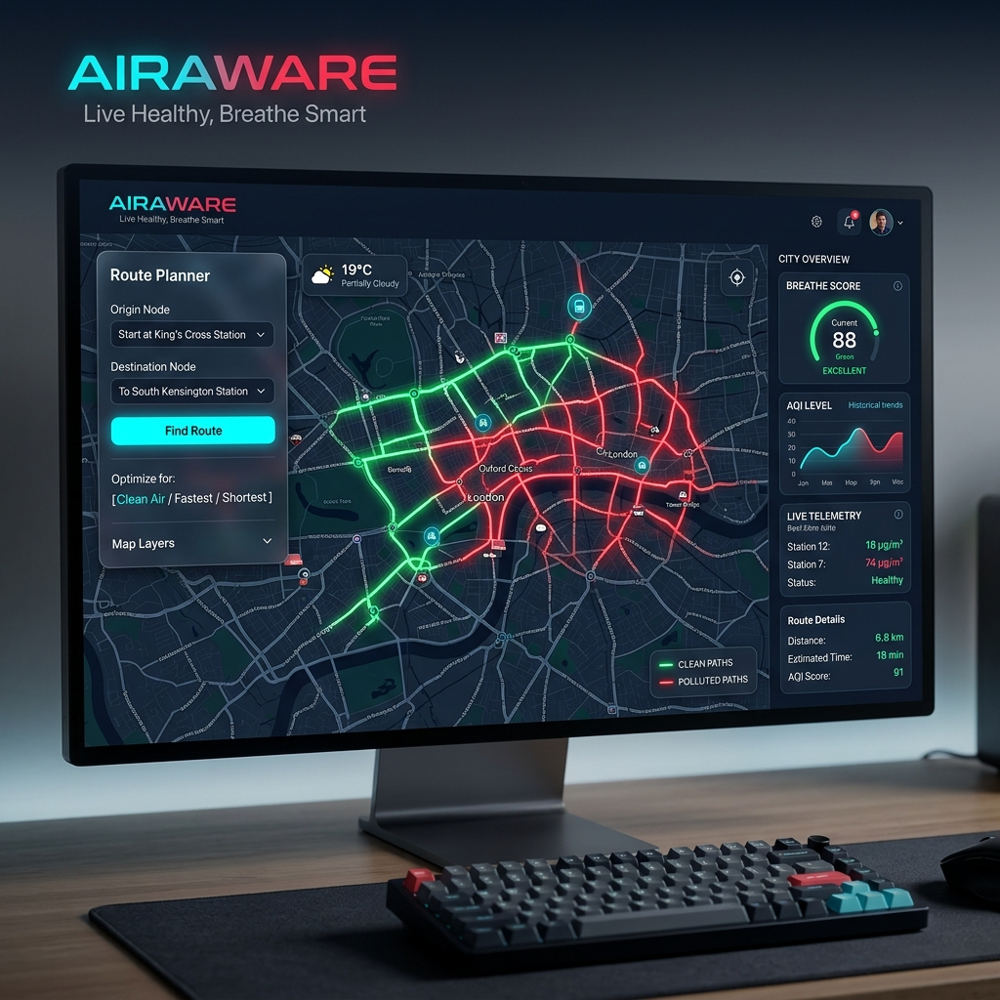

# AIRAWARE: Predictive Micro-Zoning Engine 🌍💨

<div align="center">
  
</div>

**AIRAWARE** is an advanced, AI-driven Smart City platform designed to transform how urban governments and citizens manage air quality. Built as a solution for Delhi's winter smog crisis, AIRAWARE moves beyond reactive "blanket bans" by providing **Predictive Micro-Zoning**, hyper-local ML forecasting, and health-optimized dynamic routing.

## 🚀 The Core Problem & Solution

**The Problem:** Traditional air quality management is reactive and relies on city-wide averages. Governments deploy anti-smog resources and enforce traffic bans *after* an entire city reaches severe pollution levels, causing massive economic disruption while failing to address hyper-local "gas chambers."

**The Solution:** AIRAWARE acts as a Predictive Micro-Zoning Engine. Using a highly optimized **Stacking Machine Learning Ensemble**, it predicts *where* specific micro-hotspots will form hours in advance. This enables:
1. **Pre-deployment** of municipal resources (e.g., anti-smog water cannons) directly to the predicted coordinates.
2. **Dynamic Traffic Diversion** (The "Clean Route" API) to automatically reroute non-essential traffic away from forming hotspots before the pollution concentrates into a hazard.

---

## 🧠 Machine Learning Architecture

The predictive core of AIRAWARE is built on a sophisticated Stacking Ensemble designed to handle spatiotemporal atmospheric volatility.

- **Base Learners:** `XGBoost`, `LightGBM`, `CatBoost`, `RandomForest`
- **Meta-Learner:** `Ridge Regression`
- **Live Inference Engine:** Integrates real-time OpenWeatherMap thermodynamics (temperature, humidity, wind speed) with live WAQI metrics.
- **Spatiotemporal Features:** Includes Geodesic distance to major traffic junctions (`distance_to_major_road`), historical 48-hour lags, and 6-hour volatility standard deviations to immediately detect and adapt to sudden anomaly spikes (like fires).

### Performance Metrics (Testing Split)
- **MAE (Mean Absolute Error):** `17.54 µg/m³`
- **RMSE:** `29.34 µg/m³`
- **R² Score:** `0.696`

---

## 🛠️ Features & Functionality

### 1. Live "Click-to-Predict" Inference
Citizens can click anywhere on the Interactive Map. The backend immediately fetches live thermodynamics and base PM2.5 levels, feeding them into the ML pipeline to return a hyper-local PM2.5 prediction in real-time.

### 2. Health-Optimized Routing ("Cleanest vs Fastest")
A proprietary API that calculates the geodesic path between an origin and destination, running continuous ML inference along the path. It returns the "Cleanest Route", ensuring vulnerable citizens minimize their PM2.5 exposure during commutes.

### 3. Government / Admin Dashboard Mode
A specialized UI toggle that shifts the platform into "Admin Mode", highlighting critical predicted hotspots in red to assist traffic authorities in dynamic rerouting and resource allocation.

### 4. MLOps (Continuous Training)
Fully automated Continuous Training pipeline using GitHub Actions. The model autonomously retrains itself on newly ingested CSV data on a scheduled basis, adapting to shifting atmospheric and climatic trends without human intervention.

---

## 💻 Tech Stack

- **Backend:** Python, Flask, Pandas, NumPy, Scikit-Learn
- **Machine Learning:** XGBoost, LightGBM, CatBoost
- **Frontend:** Vanilla JavaScript, HTML5, Deep Glassmorphism CSS, Leaflet.js
- **DevOps/MLOps:** GitHub Actions (CI/CT)
- **APIs:** OpenWeatherMap, WAQI, OpenRouteService

---

## ⚙️ Installation & Usage

### 1. Clone the Repository
```bash
git clone https://github.com/Methun-21/AirQI.git
cd AirQI
```

### 2. Set Up the Virtual Environment
```bash
python -m venv .venv
# On Windows PowerShell:
.\.venv\Scripts\Activate.ps1
# On Mac/Linux:
source .venv/bin/activate
```

### 3. Install Dependencies
```bash
pip install -r requirements.txt
```

### 4. Run the Application
```bash
python app.py
```
Open your browser and navigate to `http://127.0.0.1:5001/`

---

## 📄 Academic & Professional Context
This project is being developed into a formal research paper titled:
*"Predictive Micro-Zoning and Dynamic Traffic Diversion for Urban Air Quality Management using Stacking Ensembles: A Case Study in Delhi."*

Developed by Methunraj A.
