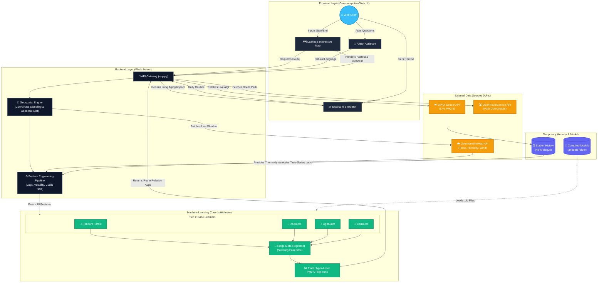

# AIRAWARE System Architecture

This architecture outlines the end-to-end data pipeline, demonstrating how raw environmental data and geographical coordinates are transformed into actionable health metrics by the machine learning backend.

### Key Components to describe in your Paper:
1. **Frontend Layer:** The interactive visual interface built on Leaflet.js, managing User Inputs (routines, queries, start/end points).
2. **External Data Ingestion:** Demonstrates real-time reliance on OpenWeatherMap (Thermodynamics) and WAQI (Base PM2.5).
3. **Geospatial & Feature Engineering:** Where the coordinates get sampled every 5th point and converted into the 18 advanced features (Sine/Cosine time, 24h lags, geodesic distance to highways).
4. **The Stacking Ensemble Layer:** Highlights the 4 distinct gradient boosters feeding into the final Ridge regressor, emphasizing the project's deep ML complexity.
